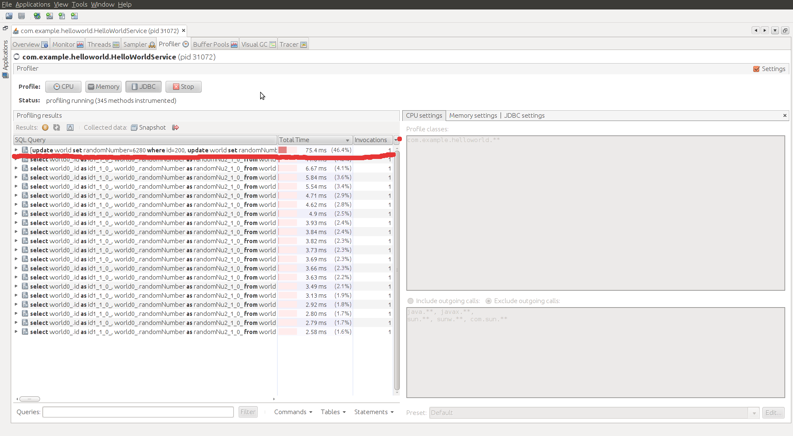
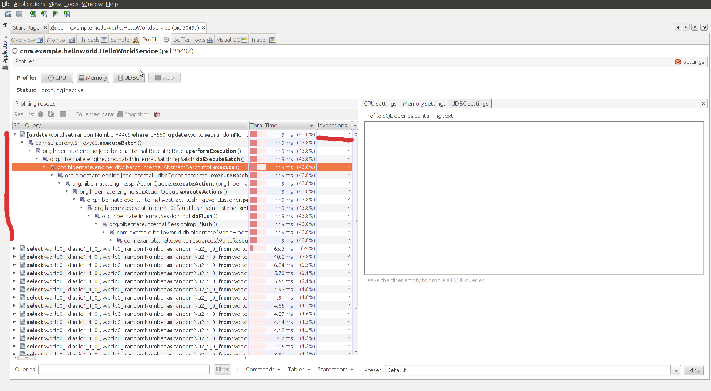
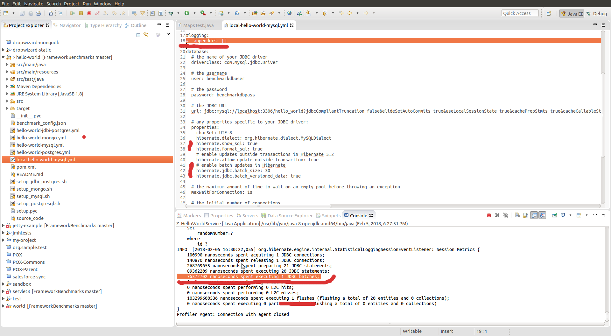

# dropwizard/Hibernate batch updates

The HTTP query is: `http://localhost:9090/db/update?queries=20`
What SQL queries are hitting the JDBC driver when the above executes?

The same with expanded stacktrace:

What `Hibernate` is logging as performed operations:

The dropwizard [configuration file to enable hibernate logs](local-hello-world-mysql.yml).
